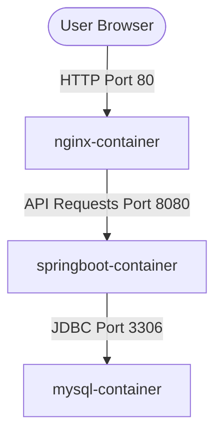
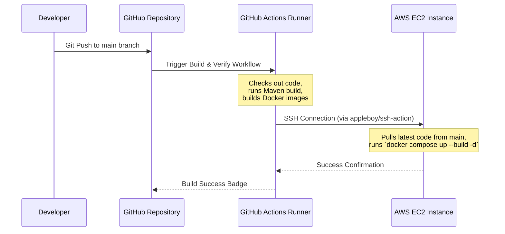

# Employee CRUD Application — Full-Stack DevOps Pipeline

This repository contains a full-stack Employee Management (CRUD) application, containerized with Docker, automated with GitHub Actions, and deployed on an AWS EC2 instance. 

The project demonstrates a complete, modern CI/CD GitOps workflow for a multi-service application containing:
*   **Frontend**: A responsive vanilla HTML, CSS, and JavaScript interface served via **Nginx**.
*   **Backend**: A REST API built with **Java Spring Boot** and Maven.
*   **Database**: A containerized **MySQL** database for persistent storage.

---

## System Architecture

The application runs in three isolated Docker containers orchestrated together via Docker Compose:



### CI/CD Deployment Flow



---

## Local Setup & Running Locally

You can spin up the entire stack locally with a single command. 

### Prerequisites
*   Docker Desktop (includes Docker Compose)
*   Git

### Step-by-Step Launch
1.  **Clone the repository**:
    ```bash
    git clone https://github.com/<your-github-username>/<your-repository-name>.git
    cd <your-repository-name>
    ```

2.  **Start all services**:
    ```bash
    docker compose up --build -d
    ```
    *This builds the Spring Boot JAR, compiles the Docker images for frontend and backend, and starts MySQL with a health check.*

3.  **Access the application**:
    *   **Frontend Interface**: Open `http://localhost` (or the port mapped to your frontend container) in your browser.
    *   **Backend REST API**: Access `http://localhost:8080/api/employees` (or your mapped backend port) to view JSON data.
    *   **MySQL Database**: Runs on container port `3306` (forwarded to your configured host port, e.g., `3307`, for direct SQL client access).

4.  **Tear down services**:
    ```bash
    docker compose down
    ```

---

## CI/CD Pipeline (GitHub Actions)

The deployment pipeline is fully automated via the GitHub Actions workflow located in [.github/workflows/build.yml](.github/workflows/build.yml). It is divided into two jobs: **Build & Verify** and **Deploy**.

### 1. Build & Verify Job
Runs on every push or pull request to the `main` branch.
*   **Checkout**: Clones the repository codebase.
*   **JDK 17 Setup**: Configures JDK 17 (Eclipse Temurin) and caches Maven dependencies to speed up future runs.
*   **Maven Build**: Compiles the Spring Boot project and packages it into a runnable JAR file (`mvn clean package`).
*   **Docker Build Dry-Run**: Builds both the Frontend and Backend Docker images locally on the runner to verify there are no syntax or configuration errors (does not push to a public registry).

### 2. Deploy Job
Triggers **only** when changes are pushed directly or merged into the `main` branch.
*   Uses `appleboy/ssh-action` to connect to the AWS EC2 instance over SSH.
*   Uses repository secrets to securely authorize the connection.
*   Executes the following deployment commands on the remote EC2 server:
    ```bash
    cd ~/<your-repository-name>
    git pull origin main
    docker compose up --build -d
    ```

---

## AWS EC2 Deployment Details

To host this application in a live production environment, we deploy to an AWS EC2 Ubuntu instance.

### Remote Server Preparation
To duplicate this deployment on a new EC2 instance, ensure the server is configured as follows:

1.  **Install System Packages**:
    ```bash
    # Update packages
    sudo apt update && sudo apt upgrade -y
    
    # Install Docker
    sudo apt install docker.io -y
    sudo systemctl start docker
    sudo systemctl enable docker
    
    # Add your user to the docker group so sudo isn't required
    sudo usermod -aG docker $USER
    
    # Install Docker Compose
    sudo apt install docker-compose-v2 -y
    ```

2.  **Clone Repository to Remote VM**:
    ```bash
    cd ~
    git clone https://github.com/<your-github-username>/<your-repository-name>.git
    ```

3.  **Configure AWS Security Groups**:
    Ensure the following inbound rules are added to your EC2 instance's security group:
    *   `Port 22` (SSH) — Restricted to GitHub Action runner IPs (or open to standard SSH environments).
    *   `Port 80` (HTTP) — Open to allow user browser access to the frontend.

### GitHub Repository Secrets Configuration
To enable the Deploy job to authenticate and deploy, navigate to **Settings > Secrets and variables > Actions** in your GitHub repository and add the following secrets:

*   `EC2_HOST`: The Public IP or Public DNS address of your EC2 instance.
*   `EC2_USERNAME`: The SSH user account (usually `ubuntu` for Ubuntu Server).
*   `EC2_SSH_KEY`: The contents of your private SSH key (`.pem` file) matching the key pair assigned to the EC2 instance.

---

## Project Structure

```text
├── .github/
│   └── workflows/
│       └── build.yml             # GitHub Actions CI/CD configuration
├── backend/
│   ├── src/                      # Java Spring Boot source code
│   ├── Dockerfile                # Multi-stage/simple JDK build image
│   └── pom.xml                   # Maven dependencies and build configuration
├── frontend/
│   ├── index.html                # Main web interface HTML
│   ├── style.css                 # Custom styling
│   ├── script.js                 # API interactions and DOM management
│   └── Dockerfile                # Nginx web server image config
└── docker-compose.yml            # Multi-service orchestration mapping
```
